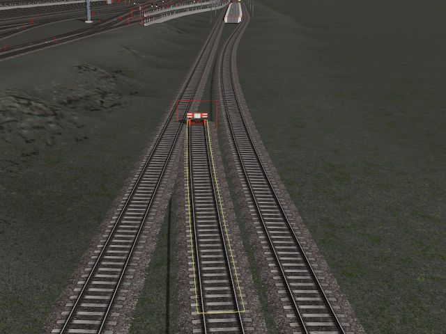

# Easement curve guide

- Introduction
- Joining two straight tracks with a specific radius of curvature
- Extending a track to join another straight track
- Other ways of implementing the curve data

## Introduction

Starting up the GUI gives you this:

- There are two methods of calculating easement curves - you can select them with the `Select method` menu. Below is a short description of what each method does.
- Then there is the speed tolerance and minimum radius. The speed tolerance (which can either be in mph or km/h) determines how long the easement curves are, and it scales linearly - if you double the speed tolerance the length between specific radii of curvature is also doubled. The minimum radius of curvature sets an upper limit on the curvature.
- The `Clear` button clears away all the fields in the 'Curve data' section. The `Calculate` button does what it says on the tin.
- At the bottom is the table which gives you the easement curve coordinates you need to recreate the curve in Train Simulator.

Let's get started with some examples of joining up tracks with easement curves.

## Joining two straight tracks with a specific radius of curvature

Suppose we have two straight tracks, and we want to create a section with easement curves of radius of curvature 3,200 m to join them. The track rule we're using has a speed tolerance of 120 mph and minimum radius of curvature 1,000 m.

1. As we need a specific radius of curvature, we select method 1. We double click on the first track - it doesn't matter where exactly. The coordinates rolls out.

   

   

2. We want the *x* and *z* coordinates `(569.349, 662.636)` and the *y*-axis rotation `73.085`, and enter them.

   > :information_source: It's easy to get confused but in TS2016 the *x* and *z* axes are the horizontal, while the *y* axis is the vertical axis. This is in contrast to the standard Cartesian coordinates where *x* and *y* are the horizontal axes.

3. We also need the quadrant. Move the camera down to the track and look down the track in the direction you want to build the curve in. The compass says it's about 75 degrees between N and E, therefore the quadrant is `NE`. We enter that in.

   

   > :information_source: The *y*-axis rotation value is in the [-90, 90] range only, which is half that needed for the full 360 degrees range. Including the quadrant solves this problem. See the [reference](reference.md) for more on this.

   > :warning: Take care with tracks aligned towards W (*y*-axis rotation -90) or E (*y*-axis rotation 90), as the rotation values are very similar on either side of the axis.

4. We do the same thing for the second track - again, it doesn't matter where exactly on the track. The coordinates are `(681.732, 700.001)` and the rotation is `69.511`.

   

5. Finally, we enter the radius of curvature `3200` m. The direction can be left as `N/A`, as we're only interested in the shortest curve. Clicking `Calculate` gives us the results.

   > :information_source: Picking CW or ACW will force the curve to be aligned in that direction, even if it's a much longer curve and crosses itself. By leaving it at N/A by default the curve will be aligned in the shortest direction. 

6. We need to recreate the curve in Train Simulator. The start point is at `(508.235, 644.051)`, so we find that point on the first track by double clicking it until the coordinates rollout gives us the correct values.

   

7. Looking straight down at the gizmo, we use the cut tool exactly where the gizmo's centre is. The extranenous section is deleted.

   

8. We extend an easement curve from that point to radius of curvature `3200.0`,

   

9. and create another curve of constant radius of curvature, ie a static curve, and making sure it is longer than needed (so we can cut it in the right place).

   

10. We find the end point of the static curve by looking for the right coordinates - just keep double clicking until the coordinates show `697.867` for the *x*-axis coordinate. We cut the curve at that point, as before.

    

    > :information_source: If the radius of curvature is small you can find the correct place to cut the track by looking for the  *y*-axis rotation value - but as 3,200 m is quite large the *x* and *z* position values are more accurate.

11. Finally, we extend another easement curve, straightening it out to join the second straight track.

    

    Assuming the coordinates are correct, it should weld without any problems!

## Extending a track to join another straight track

The second method calculates easement curves starting at a specific point, not just on straight track but also curved track, as long as the curved track is in the same direction as the curve that joins them up. As the radius of curvature shown by Train Simulator for a track is only accurate to 1 decimal place, the tool uses an additional pair of coordinates to acquire a more accurate radius of curvature for the starting track. If the starting track is straight, the additional pair of coordinates can be left blank.

Suppose we want to extend an curved track to join with a straight track with easement curves, using a track rule with 60 mph speed tolerance and minimum radius 400 m:

1. This time, it is important where the starting coordinate is. We hover the cursor just outside the end of the bounding box for the track loft - the yellow boundary should still be visible. Double clicking gives us the coordinates right at the end of the track. We enter these coordinates on the second line.

   

2. For the second set of coordinates, we double click on another point on the curved track that's not too close, and enter the coordinates.

   

   > :information_source: It doesn't matter where the second pair of coordinates is, just as long as it's on the same track section with the same radius of curvature. If you're starting on a easement curve you can extend a static curve with the easement tool and pick a pair of coordinates before deleting the curve - it will work either side of the starting point.

3. Finally, we enter the coordinates of the straight track - it doesn't matter where exactly on the track.

   

4. Clicking `Calculate` gives us the results.

5. Since we've already defined a start point, we can start with extending the easement curve to radius of curvature `844.4` m.

   

6. Following the rest of the instructions as with the first example (no. 9 onwards) should result in us joining up with the second track.

   

## Other ways of implementing the curve data

The above instructions show one way to recreate the curve in Train Simulator, but it may not always work because Train Simulator will only show radius of curvature and length of tracks with one decimal place - any hidden errors when laying down the track can easily blow up and make the curve unable to join the second track.

Another way of laying down the track would be to look at the coordinates for the start and the end of the static curve, and lay down two straight tracks whose ends match up with those coordinates. Then, with Train Simulator's joining tool, the static curve is formed by joining those tracks without easements. The straight tracks are deleted and new easement curves created in place, both of which should join up with the starting and ending tracks without problems.