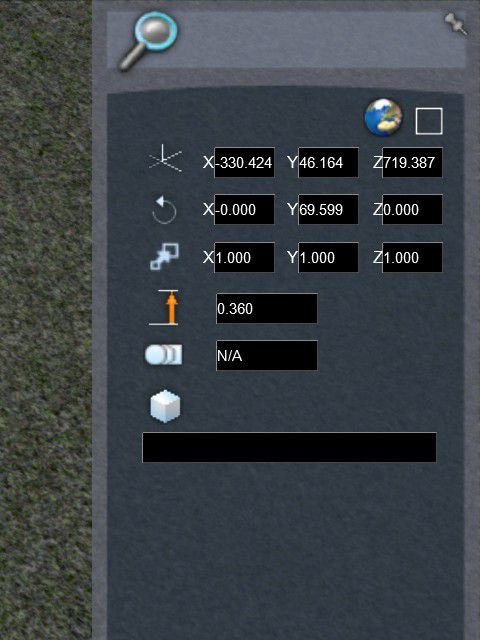

# Easement curves reference

## Finding the coordinates
Every object within a Train Simulator route, including tracks and lofts, has a set of coordinates for translation, rotation and scale. They can be discovered by double clicking on the objects, which brings up a dialog on the right. The transform dialog contains entry fields for translation, rotation and scale in the *x*, *y* and *z* axes.

For the tracks and lofts you can double click on any point along the loft to get its coordinates. If you hover the cursor just outside the end of the loft's bounding box but still keeping the yellow bounding box visible, you can get the coordinates right at the end of the loft.

### Position values and the grid
The *x* and *z* axes are horizontal and are aligned towards the North and the West respectively. They are usually relative to the grid points covering a TS2016 route, which is made up of 1,024 m x 1,024 m tiles. You can tell which grid tile you are in by looking at the far bottom left, which shows something like `+00000000-00000001`.

You can also make grids visible by selecting this option on the left rollout:

When dealing with tracks that are far apart, you will need to bear in mind that the tracks can be positioned relative to different tiles, even if they are not inside those grid tiles. For instance, if you know that one track is inside a tile adjacent to one south where a second track is, and their coordinates do not match up with the distances shown, you would need to add 1,024 to the *z*-axis coordinate for the first track.

### Rotation values
Tracks are aligned according to their rotation values in the vertical *y*-axis. However, there are two issues with *y*-axis rotation values. Firstly, the values shown on the rollout dialog is always within the -90 to 90 range, which is half that required for a full range of 360 degrees. Secondly, the rotation value is relative to the direction the track was laid in, which is not always the same as the direction you want to lay new track in. As a result, an extra coordinate is needed: the bearing quadrants `NE`, `SE`, `SW` and `NW`.

| Bearing    | *y*-axis rotation | Quadrant |
| ---------- | ----------------- | -------- |
| 0 to 90    | 0 to 90           | `NE`     |
| 90 to 180  | 90 to 0           | `SE`     |
| 180 to 270 | 0 to -90          | `SW`     |
| 270 to 360 | -90 to 0          | `NW`     |

The easiest way to find which quadrant the track is aligned towards is to pin the compass rollout dialog at the top, and look down the track.

If the compass shows it is between N and E, or between the bearing values 0 and 90, the quadrant is `NE`. If it's between 90 and 180, it would be `SE`, and so on. With the four quadrants the sign of the *y*-axis rotation does not matter - a value of 90 or -90 will be treated the same.

## Speed tolerance
The speed tolerance is used by TS2016 to determine how long easement curves should be for set radii of curvature. At higher speeds a train will cover more distance in the same length of time, and if the easement curves are too short the transition from straight to curved track with centrifugal force will be too short, leading to jerky movement. By increasing the speed tolerance, the transition curve is stretched out leading to smoother travel over the rails.

You can find out what speed tolerances is used for a predefined track rule by finding the TrackRule `.bin` file (usually in `RailNetwork\TrackRules` for a route/package) and extract the `.xml` file by using `serz.exe` in the `RailWorks` directory. Each track rule in TS2016 has 4 types: Mainline, Passenger, Freight and Yard; generally in order of highest to lowest speed tolerance. You can change the type of a track after laying it down, but because you can only define the speed tolerance in the track rule before laying down the track you are stuck with 4 possible values for a route. When creating a new route you should create your own track rule and carefully consider the speed tolerance values to ensure they are suitable for the speeds on your route.
